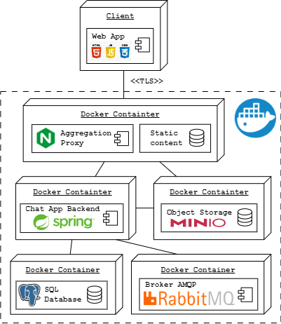

# TMDAD_2023

Este repositorio contiene el código desarrollado para la asignatura *Tecnologías y modelos para el desarrollo de aplicaciones distribuidas* del *Master de Ingeniería Informática* de la *Universidad de Zaragoza* en el año 2023.

El proyecto consiste en una aplicación de chat distribuida. A continuación se muestra un diagrama de despliegue de los principales componentes del proyecto junto con las tecnologías que se han utilizado.

# Estructura

El repositorio se divide en 4 directorios principales, cada uno con el código correspondiente a un componente diferente de la aplicación.

El directorio raíz contiene scripts de Bash que facilitan el despliegue y los archivos de configuración de Docker necesarios para realizar un despliegue local de la aplicación.

## Websockets

Contiene el código de el componente ``Chat App Backend`` desarrollado en Kotlin utilizando Spring.

## Gateway

Contiene los archivos de configuración de Nginx y certificados de ejemplo para ``localhost`` del componente ``Aggregation Proxy``.

## Static

Contiene el código HTML, CSS y JavaScript de la aplicación web de ejemplo desarrollada para verificar el funcionamiento del resto del sistema.

## Database

Contiene los archivos SQL necesarios para inicializar la base de datos PostgreSQL.

# Despliegue

Para desplegar la aplicación simplemente se ha de ejecutar el siguiente comando

    ./run.sh

Si se quieren borrar los datos permanentes generados en un despliegue previo ejecutar

    ./reset.sh

